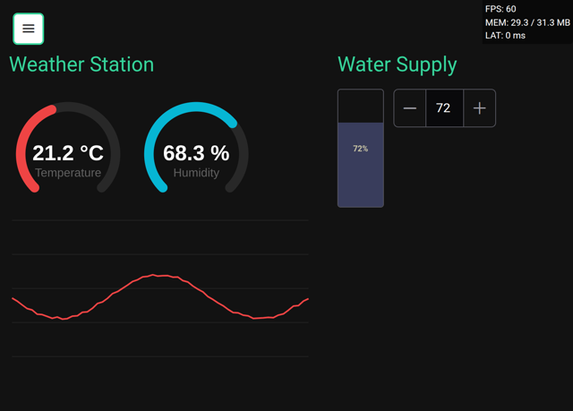

# RCH — Realtime Control Hub

**Self-hosted control dashboard for robotics and IoT. Zero frontend code required.**

You build the backend — MQTT brokers, REST APIs, WebSocket streams, ROS 2 nodes. RCH gives you the control panel: drag widgets onto pages, bind them to your endpoints, and have a production-ready dashboard in minutes instead of weeks.

Free and open-source. MIT licensed. One Docker command.

🌐 [Live Demo](https://demo.rch.kwaad.cloud) · 🏠 [Website](https://rch.kwaad.cloud) · 💬 [Discord](https://discord.gg/ptCvyXAAnV) · 📝 [Issues](https://github.com/kwaadx/rch/issues)



## Why RCH

- **43 widget types** — buttons, joysticks, sliders, gauges, video streams, charts, data tables, and more
- **4 protocol connectors** — REST, MQTT, WebSocket, ROS 2 in one dashboard
- **AI-powered setup (MCP)** — built into the image; connect Kiro, Claude, Cursor, Windsurf, or Continue.dev and build dashboards through natural language
- **13 data transforms** — scale, deadzone, lowpass filter, clamp, map_range, chain them together
- **ACK-confirmed commands** — know your hardware actually executed the command (fire / ack / submit modes)
- **RBAC** — admin, editor, operator, viewer — workspace-scoped. Operators can't break config.
- **13 languages**, PWA, works on desktop and mobile
- **Self-hosted** — your data stays on your network. No cloud, no subscription, no telemetry.

## Who Is This For

**Hardware hobbyists** — You have a Raspberry Pi project with MQTT endpoints and an ugly `index.html` with one button. RCH replaces weeks of frontend work with 15 minutes of configuration.

**Students & educators** — Your TurtleBot drives but you need a proper control panel for the demo, not a terminal with ROS topics. Set up in 15 minutes, looks professional.

**Small businesses** — Your operator needs to press "Water" on a tablet and see confirmation. You need RBAC, audit logs, and ACK — without hiring a frontend developer.

## Quick Start

```yaml
# docker-compose.yml
services:
  rch:
    image: ghcr.io/kwaadx/rch:latest
    ports:
      - "19580:19580"
    volumes:
      - rch_data:/var/lib/rch
    restart: unless-stopped

volumes:
  rch_data:
```

```bash
docker compose up -d
```

Open **http://localhost:19580** — done.

Data is stored in the `rch_data` volume and survives container restarts and image updates.

> Or clone this repo for a ready-made setup:
> ```bash
> git clone https://github.com/kwaadx/rch.git
> cd rch && docker compose up -d
> ```

## Concepts

- **Workspace** — isolated project environment; all resources belong to a workspace
- **Screen** → **Page** → **Widget** — UI hierarchy; screens contain pages, pages contain widgets
- **Widget** — UI control (button, joystick, slider, gauge, video, chart, etc.)
- **Source** → **Endpoint** — device connection; source is the transport (REST / MQTT / ROS 2 / WebSocket), endpoints are individual channels
- **Binding Group** → **Binding Mapping** — links widgets to endpoints for real-time data flow
- **Roles** — `admin`, `editor`, `operator`, `viewer` — workspace-scoped permissions

## Default Credentials

| User | Password |
|------|----------|
| `admin` | `admin` |

> ⚠️ Change passwords after first login.

## Environment Variables

| Variable | Default | Description |
|----------|---------|-------------|
| `COOKIE_SECURE` | `false` | `true` when behind HTTPS |
| `COOKIE_SAMESITE` | `Lax` | `Lax` / `Strict` / `None` |
| `COOKIE_DOMAIN` | *(auto)* | Cookie domain override |
| `JWT_SECRET_KEY` | *(auto)* | Auto-generated, persisted in volume |
| `JWT_TOKEN_EXPIRE_MINUTES` | `30` | Access token TTL |
| `SESSION_MAX_CONCURRENT` | `5` | Max sessions per user |
| `SESSION_REFRESH_TOKEN_EXPIRE_DAYS` | `30` | Refresh token TTL |
| `VAPID_PUBLIC_KEY` | — | Push notifications |
| `VAPID_PRIVATE_KEY` | — | Push notifications |
| `VAPID_CONTACT_EMAIL` | — | Push notifications |
| `API_ENABLE_DOCS` | `false` | Enable Swagger UI at `/api/docs` |

## AI Integration (MCP)

RCH ships with a built-in [MCP server](https://modelcontextprotocol.io/) — no separate install, no extra process to run. Generate a key in the UI and paste the config into your AI tool.

**Supported clients:** Kiro CLI, Claude Code, Claude Desktop, Cursor, Windsurf, Continue.dev, VS Code (Copilot Chat).

### Three steps

**1. Generate an API key**

Sidebar → **API Keys** → **Create Key**. Pick a scope (`Dashboard Management` is a good default) and copy the key. It's shown only once.

**2. Paste the config**

The Create Key dialog shows ready-made snippets for every supported client. For Kiro / Cursor / Windsurf / Continue.dev:

```json
{
  "mcpServers": {
    "rch": {
      "url": "http://localhost:19580/mcp",
      "headers": {
        "Authorization": "Bearer rch_pat_..."
      }
    }
  }
}
```

For Claude Code:

```bash
claude mcp add --transport http rch http://localhost:19580/mcp \
  --header "Authorization: Bearer rch_pat_..."
```

For Claude Desktop (uses the [`mcp-remote`](https://www.npmjs.com/package/mcp-remote) shim since Desktop is stdio-only):

```json
{
  "mcpServers": {
    "rch": {
      "command": "npx",
      "args": [
        "mcp-remote",
        "http://localhost:19580/mcp",
        "--header",
        "Authorization:Bearer rch_pat_..."
      ]
    }
  }
}
```

**3. Ask**

> *"Create a temperature gauge bound to my MQTT topic `sensors/temp` on broker `mqtt://192.168.1.100`."*

The AI handles widget creation, source setup, and bindings automatically.

**37 tools** cover workspaces, widgets, sources/endpoints, bindings, payload discovery, and monitoring.

Set `MCP_ENABLE=false` in `docker-compose.yml` to disable the bundled MCP server.

## User Management

```bash
docker exec rch python -m src.cli --help            # all commands
docker exec -it rch python -m src.cli create-user    # create user (interactive)
docker exec -it rch python -m src.cli reset-password # reset password
```

## License

MIT — free for personal and commercial use.

> RCH is actively developed by a solo developer. Feedback and ideas are welcome — open an issue or start a discussion.
> For custom widget development — [let's talk](https://rch.kwaad.cloud/).
